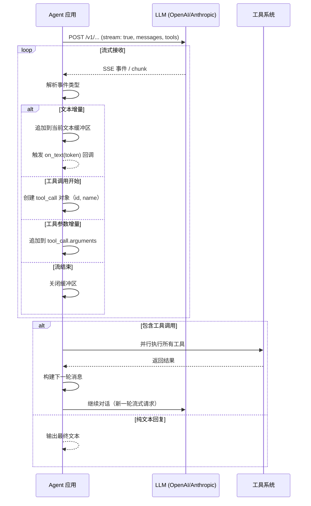
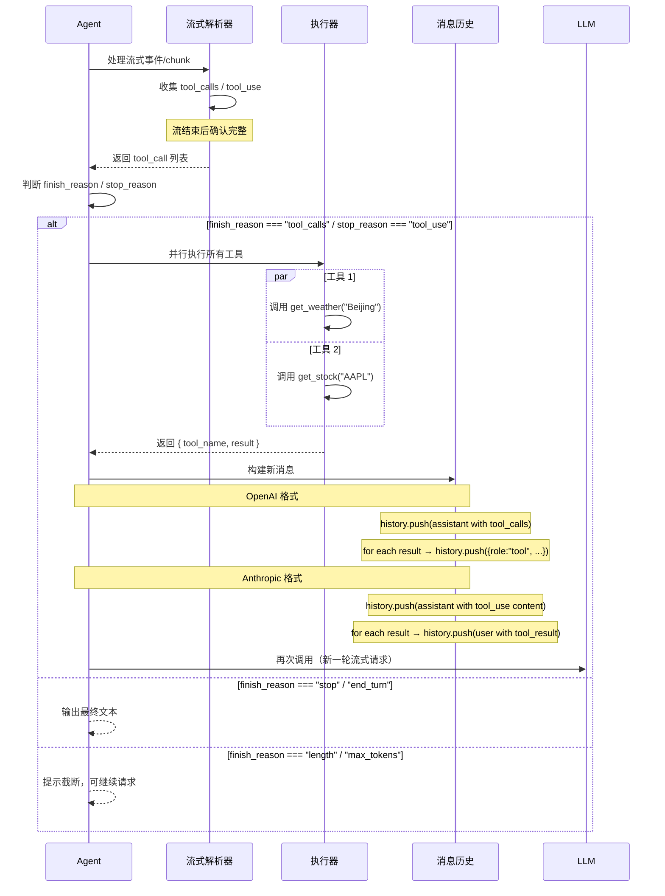
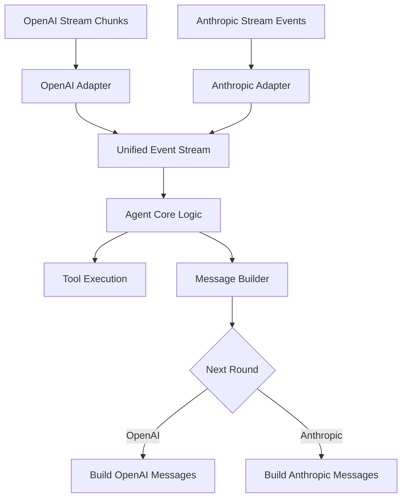

# LLM 接口协议对比:OpenAI Chat Completions vs Anthropic Messages

> 调研时间:2026 年 6 月。本文对比当前 LLM 行业使用最广的两大对话协议:OpenAI 的 Chat Completions API 与 Anthropic 的 Messages API。涉及字段、端点、枚举值均与官方文档长期稳定版一致,关键来源已在文末列出。

---

## 0. 摘要

两个协议在"消息数组 + SSE 流式"的基本形态上相似,但在以下关键设计上有显著差异:

| 维度 | OpenAI Chat Completions | Anthropic Messages |
| --- | --- | --- |
| 端点 | `POST /v1/chat/completions` | `POST /v1/messages` |
| 认证 | `Authorization: Bearer <KEY>` | `x-api-key` + 必填 `anthropic-version` |
| System prompt 位置 | `messages` 中 `role: "system"` | 顶级 `system` 字段 |
| 必填参数 | `model`, `messages` | `model`, `messages`, **`max_tokens`** |
| 消息角色 | system / user / assistant / tool | 只有 user / assistant |
| 工具 schema 位置 | `tool.function.parameters` | `tool.input_schema` |
| 工具调用响应位置 | `message.tool_calls` | `content[].type="tool_use"` |
| 响应 content 形态 | 纯字符串 或 tool_calls 数组 | 总是 content 块数组 |
| 流式协议 | chunk 对象 + `data: [DONE]` | 类型化事件(message_start/delta/stop) |
| Token 计数 | prompt/completion/total_tokens | input/output_tokens + 缓存相关字段 |
| 提示缓存 | 无公开机制 | `cache_control: {type:"ephemeral"}` |
| 扩展思考 | o-series 内部 reasoning | 显式 `thinking` block |
| 多模态 | `image_url`、`input_audio` 块 | `image`、`document` 块 + `source.base64` |
| 错误结构 | `error.message/type/code/param` | `type="error" + error.type/message` |

Anthropic 官方提供了一个 OpenAI SDK 兼容层(<https://platform.claude.com/docs/en/api/openai-sdk>),**官方说明其目的为"测试 Claude API 的能力"**,并未推荐生产使用。

---

## 1. OpenAI Chat Completions API

### 1.1 端点与认证

- 端点: `POST https://api.openai.com/v1/chat/completions` ¹
- Header:
  - `Authorization: Bearer <OPENAI_API_KEY>` ¹
  - `Content-Type: application/json`

### 1.2 请求体关键字段

| 字段                                     | 类型              | 说明                                                              |
| -------------------------------------- | --------------- | --------------------------------------------------------------- |
| `model`                                | string          | 必填。模型 ID,如 `gpt-4o`、`gpt-4o-mini`、`o3`                          |
| `messages`                             | array           | 必填。对话消息数组(见 1.3)                                                |
| `temperature`                          | number          | 0~2,默认 1。采样温度                                                   |
| `max_tokens` / `max_completion_tokens` | integer         | 最大输出 token。`o-series` 与 2024 年后新模型统一用 `max_completion_tokens` ² |
| `top_p`                                | number          | 0~1,核采样阈值                                                       |
| `stream`                               | boolean         | 是否流式                                                            |
| `tools`                                | array           | 工具定义(见 1.5)                                                     |
| `response_format`                      | object          | Structured Outputs 配置(见 1.7)                                    |
| `n`                                    | integer         | 一次生成几个候选                                                        |
| `stop`                                 | string \| array | 停止序列                                                            |
| `presence_penalty`                     | number          | -2~2,主题新颖度                                                      |
| `frequency_penalty`                    | number          | -2~2,重复惩罚                                                       |
| `user`                                 | string          | 终端用户标识,用于滥用追踪                                                   |
| `seed`                                 | integer         | 尽量可复现的采样种子                                                      |
| `logprobs`                             | boolean/int     | 是否返回 token 对数概率                                                 |

### 1.3 消息角色

- `system` — 系统提示
- `user` — 用户输入
- `assistant` — 模型历史回复
- `tool` — 工具调用结果(通过 `tool_call_id` 关联到 assistant 的 `tool_calls`)

### 1.4 多模态输入

```json
// 图像
{ "type": "image_url", "image_url": { "url": "https://... 或 data:image/png;base64,..." } }

// 音频
{ "type": "input_audio", "input_audio": { "data": "<base64>", "format": "wav" | "mp3" } }
```

### 1.5 工具调用(Function Calling)

请求:
```json
{
  "tools": [
    {
      "type": "function",
      "function": {
        "name": "get_weather",
        "description": "查询城市天气",
        "parameters": {
          "type": "object",
          "properties": { "city": { "type": "string" } },
          "required": ["city"]
        }
      }
    }
  ]
}
```

响应: 助手消息中含
```json
"tool_calls": [
  {
    "id": "call_abc123",
    "type": "function",
    "function": { "name": "get_weather", "arguments": "{\"city\":\"Beijing\"}" }
  }
]
```

### 1.6 响应体

```json
{
  "id": "chatcmpl-abc123",
  "object": "chat.completion",
  "created": 1717000000,
  "model": "gpt-4o-2024-08-06",
  "choices": [
    {
      "index": 0,
      "message": { "role": "assistant", "content": "你好" },
      "finish_reason": "stop"
    }
  ],
  "usage": { "prompt_tokens": 12, "completion_tokens": 3, "total_tokens": 15 }
}
```

`finish_reason` 枚举: `stop` / `length` / `tool_calls` / `content_filter`。

### 1.7 Structured Outputs

```json
"response_format": {
  "type": "json_schema",
  "json_schema": {
    "name": "person",
    "schema": {
      "type": "object",
      "properties": { "name": {"type":"string"}, "age": {"type":"integer"} },
      "required": ["name", "age"],
      "additionalProperties": false
    },
    "strict": true
  }
}
```

`type` 还能是 `json_object`(旧版自由 JSON)或 `text`(默认)。

### 1.8 流式响应

`stream: true` 时返回 SSE,每行 `data: { ... }`,最后一条 `data: [DONE]`。每个 chunk:
```json
{
  "id": "chatcmpl-abc123",
  "object": "chat.completion.chunk",
  "choices": [
    { "index": 0, "delta": { "content": "你" }, "finish_reason": null }
  ]
}
```

### 1.9 错误结构

```json
{
  "error": {
    "message": "Invalid API key",
    "type": "invalid_request_error",
    "param": null,
    "code": "invalid_api_key"
  }
}
```

常见 `code`: `invalid_api_key`、`rate_limit_exceeded`、`context_length_exceeded`、`insufficient_quota`、`model_not_found`、`organization_verification_required`。⁴

---

## 2. Anthropic Messages API

### 2.1 端点与认证

- 端点: `POST https://api.anthropic.com/v1/messages`
- 必填 header: ³
  - `x-api-key: <ANTHROPIC_API_KEY>`
  - `anthropic-version: 2023-06-01`(或更新日期版本,如 `2024-10-22`)
  - `content-type: application/json`

### 2.2 请求体关键字段

| 字段 | 类型 | 说明 |
| --- | --- | --- |
| `model` | string | 必填,如 `claude-opus-4-7`、`claude-sonnet-4-5` |
| `messages` | array | 必填(见 2.3) |
| `max_tokens` | integer | **必填**。最大输出 token |
| `system` | string \| array | 顶级字段,系统提示(无 system role) |
| `temperature` | number | 0~1,默认 1 |
| `top_p` | number | 0~1 |
| `top_k` | integer | 候选 token 数 |
| `stop_sequences` | array | 自定义停止序列 |
| `stream` | boolean | 是否流式 |
| `tools` | array | 工具定义(见 2.5) |
| `tool_choice` | object | `auto` / `any` / `tool` / `none` |
| `metadata` | object | `user_id` 字段用于滥用追踪 |
| `thinking` | object | 扩展思考配置(见 2.9) |

### 2.3 消息角色

只有两种:

- `user` — 用户输入(可包含 content 块数组实现多模态)
- `assistant` — 模型历史回复(也以 content 块数组表示)

### 2.4 多模态输入

```json
// 图像(base64)
{
  "type": "image",
  "source": { "type": "base64", "media_type": "image/png", "data": "<base64>" }
}

// 文档(PDF)
{
  "type": "document",
  "source": { "type": "base64", "media_type": "application/pdf", "data": "<base64>" }
}
```

`source.type` 也能是 `url` + `https://...`。

### 2.5 工具调用

请求:
```json
{
  "tools": [
    {
      "name": "get_weather",
      "description": "查询城市天气",
      "input_schema": {
        "type": "object",
        "properties": { "city": { "type": "string" } },
        "required": ["city"]
      }
    }
  ]
}
```

响应: `content` 数组中含
```json
{ "type": "tool_use", "id": "toolu_abc123", "name": "get_weather", "input": { "city": "Beijing" } }
```

### 2.6 响应体

```json
{
  "id": "msg_abc123",
  "type": "message",
  "role": "assistant",
  "content": [
    { "type": "text", "text": "你好" }
  ],
  "model": "claude-sonnet-4-5-20251001",
  "stop_reason": "end_turn",
  "stop_sequence": null,
  "usage": {
    "input_tokens": 12,
    "output_tokens": 3,
    "cache_creation_input_tokens": 0,
    "cache_read_input_tokens": 0
  }
}
```

`stop_reason` 枚举: `end_turn` / `max_tokens` / `stop_sequence` / `tool_use` / `refusal`。

### 2.7 流式 SSE 事件

| 事件 | 说明 |
| --- | --- |
| `message_start` | 消息开始,带 `message` 初始字段 |
| `content_block_start` | 一个 content 块开始 |
| `content_block_delta` | 块增量,`delta.type` 可能是 `text_delta` / `input_json_delta` / `thinking_delta` / `signature_delta` |
| `content_block_stop` | content 块结束 |
| `message_delta` | 消息级增量,常含 `stop_reason` 与 `usage.output_tokens` |
| `message_stop` | 消息结束 |
| `ping` | 心跳 |
| `error` | 流中错误事件 |

事件粒度比 OpenAI 的 chunk 语义更明确,更容易实现"打字中"、"思考中"、"调用工具中"等细粒度 UI 状态。

### 2.8 提示缓存(Prompt Caching)

在 content block 上加 `cache_control`:
```json
{
  "type": "text",
  "text": "大段重复提示...",
  "cache_control": { "type": "ephemeral" }
}
```

`usage` 返回 `cache_creation_input_tokens`(本次新建的缓存)与 `cache_read_input_tokens`(命中的缓存,通常 1/10 价格计费)。默认 TTL 约 5 分钟,`type` 可选 `ephemeral` 或 `persistent`(1 小时)。

### 2.9 扩展思考(Extended Thinking)

请求:
```json
"thinking": { "type": "enabled", "budget_tokens": 1024 }
```

响应 `content` 中含
```json
{ "type": "thinking", "thinking": "让我先分析问题...", "signature": "..." }
```

带签名后可将整段 thinking 块回传作为 few-shot / 推理模板。

### 2.10 错误结构

```json
{
  "type": "error",
  "error": {
    "type": "invalid_request_error",
    "message": "..."
  }
}
```

`error.type` 枚举: `authentication_error` / `permission_error` / `not_found_error` / `rate_limit_error` / `invalid_request_error` / `overloaded_error` / `api_error`。HTTP 状态码 + `request-id` header 辅助排错。

---

## 3. 协议互转：消息体与事件映射

> 将 OpenAI Chat Completions 与 Anthropic Messages 相互转换时，需要在端点、认证、消息结构、工具定义、流式事件等多个层面进行映射。以下逐一说明。

### 3.1 请求体整体映射

| OpenAI 字段 | Anthropic 字段 | 转换说明 |
| --- | --- | --- |
| `model` | `model` | 直接传递，但模型名需映射（如 `gpt-4o` ↔ `claude-sonnet-4-5`） |
| `messages` | `messages` + `system` | OpenAI 的 `system` 角色消息需提取到 Anthropic 顶级 `system` 字段 |
| `max_tokens` / `max_completion_tokens` | `max_tokens` | OpenAI 中非必填，Anthropic **必填** |
| `temperature` | `temperature` | 直接映射，但 OpenAI 范围 0~2，Anthropic 0~1 |
| `top_p` | `top_p` | 直接映射 |
| — | `top_k` | Anthropic 特有，OpenAI 无对应 |
| `stop` | `stop_sequences` | 直接映射 |
| `stream` | `stream` | 直接映射 |
| `tools` | `tools` | 需转换 schema 格式（见 3.3） |
| `tool_choice` | `tool_choice` | 枚举值需映射 |
| `response_format` | — | Anthropic 无直接等价，可用 `tool_use` + `input_schema` 模拟 |
| `user` | `metadata.user_id` | 位置不同 |
| — | `thinking` | Anthropic 特有 |
| — | `cache_control` | Anthropic 特有 |

### 3.2 消息角色与内容映射

| OpenAI message | Anthropic 映射 |
| --- | --- |
| `role: "system"` | 提取到顶级 `system` 字段，不在 `messages` 数组中 |
| `role: "user"`, `content: "string"` | `role: "user"`, `content: [{ type: "text", text: "..." }]` |
| `role: "user"`, `content: [{type:"image_url",...}]` | `role: "user"`, `content: [{ type: "image", source: { type: "base64", media_type: "image/jpeg", data: "..." } }]` |
| `role: "assistant"`, `content: "string"` | `role: "assistant"`, `content: [{ type: "text", text: "..." }]` |
| `role: "assistant"`, `tool_calls: [...]` | `role: "assistant"`, `content: [{ type: "tool_use", id, name, input }]` |
| `role: "tool"`, `tool_call_id, content` | `role: "user"`, `content: [{ type: "tool_result", tool_use_id, content }]` |

**关键差异**：
- Anthropic 没有独立的 `tool` 角色。工具调用结果作为 `type: "tool_result"` 的 content block 放在 `user` 消息中。
- OpenAI 的 assistant 消息中 `tool_calls` 数组与 `content` 是平级的顶级字段；Anthropic 则将 `tool_use` 作为 `content` 数组中的一个 block。
- OpenAI 的 content 可以是纯字符串；Anthropic 的 content 总是数组。

#### 转换示例：OpenAI → Anthropic

OpenAI 请求：
```json
{
  "messages": [
    { "role": "system", "content": "你是一名助手" },
    { "role": "user", "content": "北京天气如何？" },
    { "role": "assistant", "content": "", "tool_calls": [
      { "id": "call_123", "type": "function", "function": { "name": "get_weather", "arguments": "{\"city\":\"Beijing\"}" } }
    ]},
    { "role": "tool", "tool_call_id": "call_123", "content": "20°C" }
  ]
}
```

→ Anthropic 转换后：
```json
{
  "system": "你是一名助手",
  "messages": [
    { "role": "user", "content": [{ "type": "text", "text": "北京天气如何？" }] },
    { "role": "assistant", "content": [
      { "type": "tool_use", "id": "call_123", "name": "get_weather", "input": { "city": "Beijing" } }
    ]},
    { "role": "user", "content": [
      { "type": "tool_result", "tool_use_id": "call_123", "content": "20°C" }
    ]}
  ]
}
```

### 3.3 工具定义映射

| OpenAI | Anthropic | 说明 |
| --- | --- | --- |
| `tools[].type: "function"` | — | Anthropic 的 tool 默认就是 function 类型，无需 `type` 字段 |
| `tools[].function.name` | `tools[].name` | 直接映射 |
| `tools[].function.description` | `tools[].description` | 直接映射 |
| `tools[].function.parameters` | `tools[].input_schema` | JSON Schema 格式相同，仅字段名不同 |
| `tool_choice: "auto"` | `tool_choice: "auto"` | 直接映射 |
| `tool_choice: "none"` | `tool_choice: "none"` | 直接映射 |
| `tool_choice: {type:"function",function:{name:"xxx"}}` | `tool_choice: {type:"tool", name:"xxx"}` | 指定具体工具 |
| — | `tool_choice: "any"` | Anthropic 特有，允许模型选任意工具 |

### 3.4 流式事件映射

OpenAI 流式返回 SSE chunk，Anthropic 返回类型化事件。以下是核心映射关系：

| OpenAI chunk delta 语义 | Anthropic 事件 | 说明 |
| --- | --- | --- |
| `choices[0].delta.role: "assistant"` (首个 chunk) | `message_start` + `content_block_start` | 消息开始 |
| `choices[0].delta.content: "..."` | `content_block_delta` (text_delta) | 文本增量 |
| `choices[0].delta.tool_calls[i].function.name` | `content_block_start` (tool_use) | 工具名在 block 开始时出现 |
| `choices[0].delta.tool_calls[i].function.arguments` | `content_block_delta` (input_json_delta) | 工具参数增量 |
| `choices[0].delta.tool_calls[i].id` | `content_block_start` 中的 `id` | 工具调用 ID |
| `choices[0].finish_reason` | `message_delta` 中的 `delta.stop_reason` | 结束原因（最后事件） |
| `data: [DONE]` | `message_stop` | 流结束 |
| — | `ping` | 心跳，OpenAI 无对应 |
| — | `content_block_stop` | 每个 content block 结束，OpenAI 无显式对应 |

**转换策略**：从 OpenAI chunk 构建 Anthropic 事件流需要维护每个 `index` 对应的 tool call 状态；从 Anthropic 事件流合并为 OpenAI chunk 则需要将 `content_block_delta` 中的文本和 `input_json_delta` 分别路由到对应的 chunk delta 字段。

### 3.5 错误结构映射

| OpenAI 错误 | Anthropic 错误 | 说明 |
| --- | --- | --- |
| `error.message` | `error.message` | 直接映射 |
| `error.type` | `error.type` | 部分枚举不同，需映射 |
| `error.code` | — | Anthropic 无 `code`，需从 `type` 推断 |
| `error.param` | — | Anthropic 无对应字段 |

常见错误类型映射：

| OpenAI `type` | Anthropic `type` | 含义 |
| --- | --- | --- |
| `invalid_request_error` | `invalid_request_error` | 请求参数错误 |
| `authentication_error` | `authentication_error` | 认证失败 |
| `rate_limit_exceeded` | `rate_limit_error` | 限流 |
| `insufficient_quota` | `permission_error` | 配额不足 |
| `context_length_exceeded` | `invalid_request_error`（含 message 说明） | 上下文超长 |
| `server_error` | `api_error` / `overloaded_error` | 服务端错误 |

### 3.6 特殊特性映射

| 特性 | OpenAI | Anthropic | 转换说明 |
| --- | --- | --- | --- |
| Reasoning / Thinking | `reasoning` 字段（o-series） | `thinking` block + `signature` | 两者格式不同，Anthropic 的 thinking 带签名可回传 |
| Structured Output | `response_format: {type:"json_schema", ...}` | 无原生支持，可用 `tool_use` 模拟 | 需要额外处理 |
| 提示缓存 | 无公开机制 | `cache_control: {type:"ephemeral"}` | Anthropic 独有 |
| 多模态图片 | `type: "image_url"` | `type: "image"` + `source` | URL 需转 base64 或 vice versa |
| 多模态 PDF | 不支持原生 | `type: "document"` | Anthropic 独有 |

---

## 4. Agent 流式处理与工具调用

Agent（智能体）在 LLM 调用中通常使用流式输出以获得低延迟体验。本章介绍 Agent 如何统一处理两种协议的流式响应、如何解析事件、如何提取工具调用并执行、以及如何构建下一轮对话。

### 4.1 Agent 流式处理的通用架构

一个典型的 Agent 流式处理循环如下：



### 4.2 处理 OpenAI 流式响应

OpenAI 流式响应由多个 `data: {...}` SSE 行组成，最后以 `data: [DONE]` 结束。

**核心处理逻辑**：按 `choices[0].delta` 中的字段类型进行分发。

```typescript
// 伪代码：OpenAI 流式处理器
function processOpenAIStream(chunks: SSEChunk[]) {
  let content = '';
  const toolCalls: Map<number, { id: string; name: string; arguments: string }> = new Map();

  for (const chunk of chunks) {
    const delta = chunk.choices[0].delta;

    // 角色（仅首个 chunk 有）
    if (delta.role === 'assistant') { /* 标记消息开始 */ }

    // 文本增量
    if (delta.content) {
      content += delta.content;
      emit('on_text', delta.content);
    }

    // 工具调用增量
    if (delta.tool_calls) {
      for (const tc of delta.tool_calls) {
        const idx = tc.index;
        if (!toolCalls.has(idx)) toolCalls.set(idx, { id: '', name: '', arguments: '' });
        const call = toolCalls.get(idx)!;
        if (tc.id) call.id += tc.id;
        if (tc.function?.name) call.name += tc.function.name;
        if (tc.function?.arguments) call.arguments += tc.function.arguments;
      }
    }

    // 结束原因
    if (chunk.choices[0].finish_reason) {
      emit('on_finish', chunk.choices[0].finish_reason);
    }
  }

  const toolCallList = [...toolCalls.values()]
    .map(tc => ({ id: tc.id, type: 'function', function: { name: tc.name, arguments: tc.arguments } }));

  return { content, toolCalls: toolCallList.length > 0 ? toolCallList : undefined };
}
```

**关键注意点**：
- `tool_calls` 中的 `index` 字段用于区分并行工具调用，`arguments` 是 JSON 字符串的流式拼接，需验证最终为合法 JSON。
- 部分模型（如 o-series）有 `reasoning` 字段，需与 `content` 分开处理。

### 4.3 处理 Anthropic 流式响应

Anthropic 流式响应由多个命名的 SSE 事件组成，每个事件有明确的语义。

**核心处理逻辑**：按事件类型分发，维护 content block 索引。

```typescript
// 伪代码：Anthropic 流式处理器
function processAnthropicStream(events: AnthropicEvent[]) {
  let content = '';
  const toolUses: Map<string, { id: string; name: string; input: string }> = new Map();
  let currentBlockIndex = -1;
  let finishReason = '';

  for (const event of events) {
    switch (event.type) {
      case 'message_start':
        // 消息开始，包含初始 message 元数据
        break;

      case 'content_block_start':
        currentBlockIndex = event.index;
        if (event.content_block.type === 'text') {
          // 文本块开始
        } else if (event.content_block.type === 'tool_use') {
          const id = event.content_block.id;
          toolUses.set(id, { id, name: event.content_block.name, input: '' });
        } else if (event.content_block.type === 'thinking') {
          // 思考块开始
        }
        break;

      case 'content_block_delta':
        if (event.delta.type === 'text_delta') {
          content += event.delta.text;
          emit('on_text', event.delta.text);
        } else if (event.delta.type === 'input_json_delta') {
          // 将 partial JSON 追加到当前 index 对应的 tool_use
          const toolUse = findToolUseByIndex(event.index, toolUses);
          if (toolUse) toolUse.input += event.delta.partial_json;
        } else if (event.delta.type === 'thinking_delta') {
          emit('on_thinking', event.delta.thinking);
        }
        break;

      case 'content_block_stop':
        // 当前 block 结束，可验证 tool_use 的 input 是否为合法 JSON
        break;

      case 'message_delta':
        finishReason = event.delta.stop_reason;
        emit('on_stop_reason', finishReason);
        break;

      case 'message_stop':
        // 流结束
        emit('on_finish', finishReason);
        break;

      case 'ping':
        // 心跳，忽略
        break;

      case 'error':
        emit('on_error', event.error);
        break;
    }
  }

  const toolCallList = [...toolUses.values()]
    .map(tu => ({ id: tu.id, name: tu.name, input: JSON.parse(tu.input) }));

  return { content, toolUses: toolCallList.length > 0 ? toolCallList : undefined };
}
```

**关键注意点**：
- `input_json_delta` 的 `partial_json` 不是完整的 JSON 片段，而是增量片段，需要拼接后整体解析。
- `content_block_start` 事件中 `tool_use` 的 `id` 和 `name` 是一次性给出的，无需拼接。
- `thinking` block 需要在 UI 中与 text 区分展示。

### 4.4 工具调用与执行流程

Agent 检测到流式输出中包含工具调用后，进入"执行工具 → 构建下一轮输入"的循环：



### 4.5 构建下一轮消息

工具执行完成后，需要将工具调用及其结果追加到消息历史中，形成新的一轮输入。

#### OpenAI 格式

```typescript
// 追加 assistant 消息（含 tool_calls）
messages.push({
  role: 'assistant',
  content: '', // 或已有的文本内容
  tool_calls: [
    { id: 'call_abc', type: 'function', function: { name: 'get_weather', arguments: '{"city":"Beijing"}' } }
  ]
});

// 每个工具结果追加一条 tool 消息
for (const result of toolResults) {
  messages.push({
    role: 'tool',
    tool_call_id: result.callId,
    content: JSON.stringify(result.data)
  });
}
```

#### Anthropic 格式

```typescript
// 追加 assistant 消息（content 中包含 tool_use blocks）
messages.push({
  role: 'assistant',
  content: [
    { type: 'text', text: '我来查一下天气...' },
    { type: 'tool_use', id: 'toolu_abc', name: 'get_weather', input: { city: 'Beijing' } }
  ]
});

// 工具结果作为 user 消息中的 tool_result block
messages.push({
  role: 'user',
  content: toolResults.map(r => ({
    type: 'tool_result',
    tool_use_id: r.callId,
    content: JSON.stringify(r.data)
  }))
});
```

**关键注意点**：
- Anthropic 可以将多个 `tool_result` 合并到同一条 `user` 消息中，但**不能**将 `tool_result` 与普通文本 `content` block 混合在同一条 user 消息中。
- OpenAI 的 `tool` 消息必须通过 `tool_call_id` 关联到对应的工具调用，且一个 `tool_call_id` 只能有一条 `tool` 消息。
- 如果工具返回内容很大（如图片 base64），需要考虑截断或引用，避免超出上下文窗口。

### 4.6 统一抽象层设计

对于需要同时支持两个协议的 Agent，推荐在内部建立统一的事件抽象层：

```typescript
// 统一事件抽象
interface UnifiedEvent {
  type: 'text' | 'tool_call_start' | 'tool_call_delta' | 'tool_call_stop' | 'finish' | 'error' | 'thinking';
  data: any;
}

// 适配器负责将各自协议的事件转换为统一事件
interface StreamAdapter {
  parse(chunk: any): UnifiedEvent[];
}
```



这种设计使得 Agent 核心逻辑与协议细节解耦，切换模型时只需替换适配器。

---

## 5. 选型建议

- **选 OpenAI 协议**: 生态最广、SDK 最多、几乎所有模型(开源、闭源)都实现,适合做"模型无关"应用。
- **选 Anthropic 协议**: 用 Claude 时必选,提示缓存、扩展思考、PDF 原生支持等能力与协议深度协同,流式事件粒度更细。
- **通过网关统一**: 一次集成 LiteLLM / OpenRouter / Portkey,降低多模型迁移成本;需要用 Claude 高级特性时回退原生 SDK。

---

## 6. 互转生态

- **LiteLLM** — Python SDK + 反向代理,把 100+ 模型统一成 OpenAI 协议,Anthropic 自动转换。
- **OpenRouter** — 提供 OpenAI 兼容端点,代理多家模型(含 Anthropic)。
- **Anthropic 官方 OpenAI 兼容层** — 让 OpenAI SDK 调用 Anthropic,**官方明确说"用于测试 Claude API 的能力"**,未推荐生产。
- **Portkey** — LLM 网关,支持协议转换与路由。
- **vLLM / Triton / Ollama** — 自托管推理时,前端口 OpenAI 兼容 `/v1/chat/completions`。

---

## 7. 参考资料

1. OpenAI Chat Completions 总览: <https://platform.openai.com/docs/api-reference/chat>
2. OpenAI `max_completion_tokens` 迁移说明: <https://platform.openai.com/docs/guides/reasoning>
3. Anthropic Messages API: <https://docs.anthropic.com/en/api/messages>
4. OpenAI 错误码: <https://platform.openai.com/docs/guides/error-codes/api-errors>
5. Anthropic Versions(`anthropic-version` header): <https://docs.anthropic.com/en/api/versioning>
6. Anthropic Prompt Caching: <https://docs.anthropic.com/en/docs/build-with-claude/prompt-caching>
7. Anthropic Extended Thinking: <https://docs.anthropic.com/en/docs/build-with-claude/extended-thinking>
8. Anthropic OpenAI SDK 兼容层(测试用途): <https://docs.anthropic.com/en/api/openai-sdk>
9. LiteLLM: <https://github.com/BerriAI/litellm>
10. OpenRouter: <https://openrouter.ai/docs>

