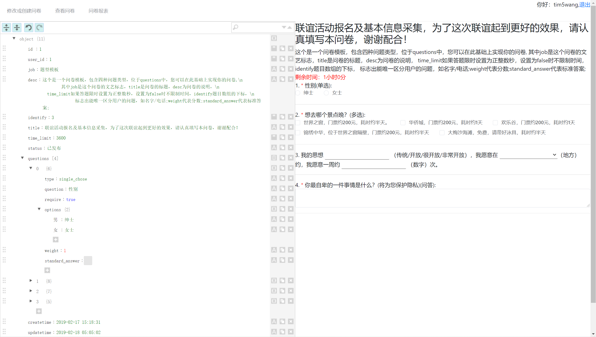
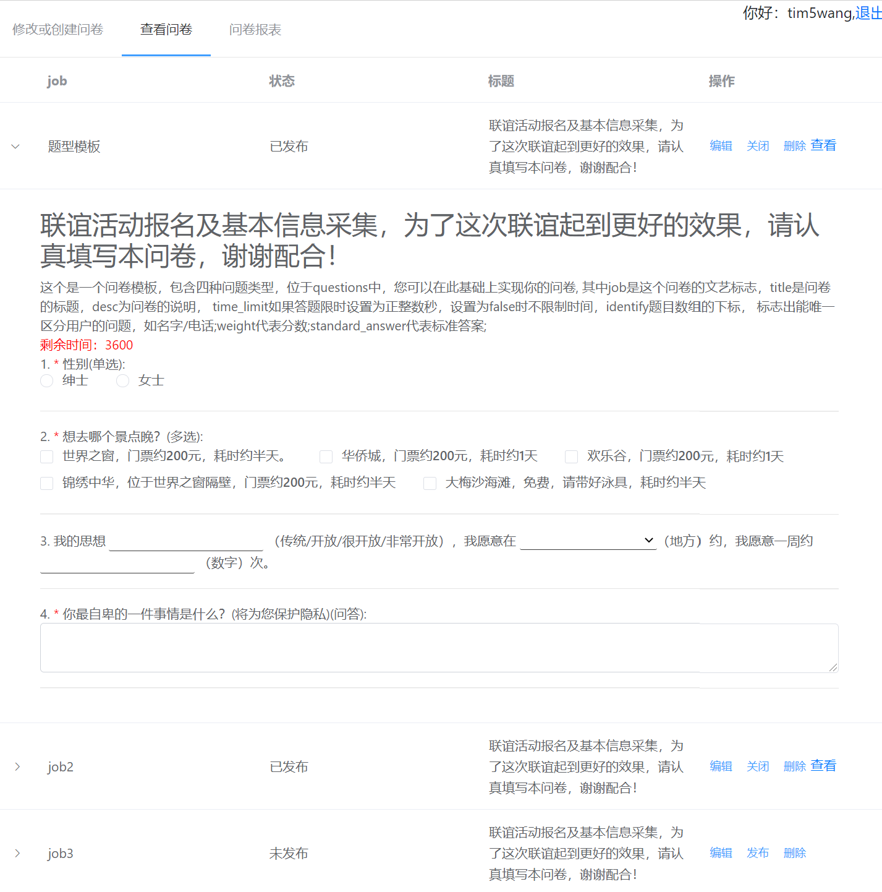
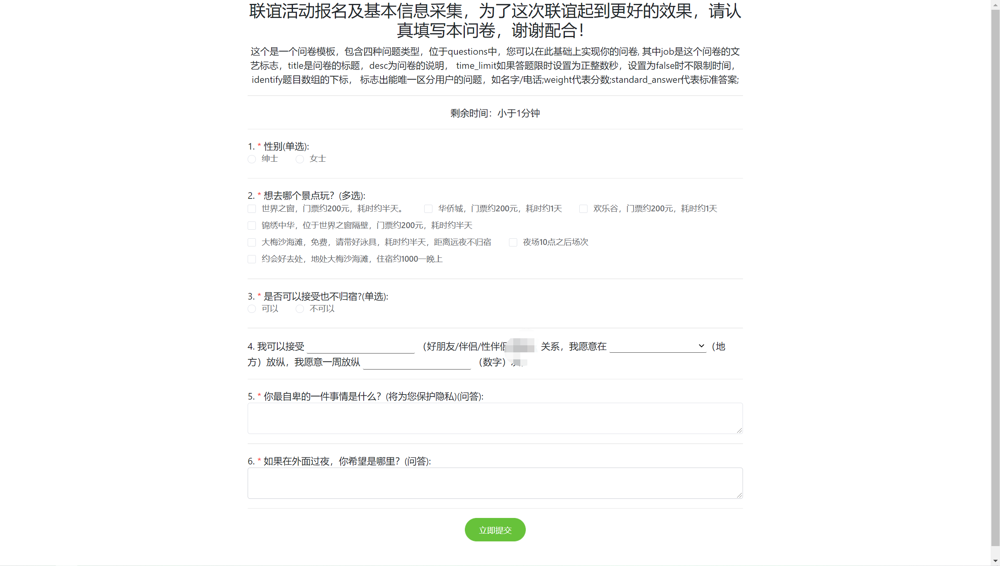

## 开发日志

[fork me on tim5wang.github.io](tim5wang.github.io)

[问卷预览](https://tim5wang.github.io/tools/fellowship/guest.html?job=job2)
[编辑问卷](https://tim5wang.github.io/tools/fellowship/admin.html)
[登录](https://tim5wang.github.io/tools/fellowship/login.html) admin 123456

---
2020.9.9
1. 提供后端源码
2.  [ ] 实现问卷报表，未来转为模块化的开发再进行
3.  [ ] 实现多用户，未来转为模块化的开发后在进行
---
2019.9.30
1. 更改接口地址。
2. 解决json编辑器重复渲染问题。
3. 解决中文job名导致的url参数解析错误问题。
4. [ ] 实现问卷报表
5. [ ] 实现多用户

---

2019.2.18

- admin.html
- 完成了修改
- 答题初步完成
- 接下来该完成答题结果展示

---

2019.2.17

- admin.html
- 完成了增加，预览，启用关闭
- 改进行问卷提交

---

2019.2.16

- index.html
- admin.html
- login.html
- 创建了业务表格
- 正在进行保存问卷

## 预览
---
1. 创建问卷，根据JSON模板创建，可视化的JSON编辑器，非常方便
   

2. 问卷管理、预览和发布。
   

3. 发布后的问卷链接
   

